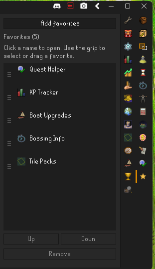

# Sidebar Favorites

Save and arrange shortcuts to your favorite RuneLite sidebar panels.

An experimental development plugin. It is **not available in the Plugin Hub**
and has not been approved by RuneLite.

## Preview



The screenshot shows the previous controls; the current version adds an **Edit / Done** mode.

The gold star defaults to the bottom of the sidebar panel icons, making it easy
to find. In RuneLite plugin settings, set **Sidebar position** to **Top** or
**Bottom**. Changes apply immediately and are saved in the active configuration
profile. Icons with the same priority may affect the exact position.

## Using favorites

1. Open the gold star near the bottom of RuneLite's sidebar.
2. Click **Add**, search for an available panel, and click its green **+**.
   The picker stays open so you can add several favorites. **Add selected** also works.
3. Click a favorite's name to open that plugin's original panel.
4. Click **Edit** to organize favorites without opening their panels. Click a row to select it,
   then use **Up / Down**, or drag and drop to reorder.
5. In Edit mode, click the red **×** beside a favorite to remove it, or select it and click **Remove**.
   Click **Done** to return to opening panels.

The **Add** and **Edit** buttons share the top row with a settings gear. The gear
opens a local settings view backed by the same RuneLite configuration values. Turn off **Show instructions**
in plugin settings to hide the help text and leave more room for favorites. Both
lists scroll vertically when their entries exceed the available space.

Set **Open Favorites hotkey** in plugin settings to open the panel with a shortcut.
It is unassigned by default and uses RuneLite's normal game-focus hotkey handling,
including the login screen. Pressing it opens Favorites; it does not toggle it closed.
Suggested shortcuts: **Ctrl+F**, **Ctrl+Shift+F**, or **Alt+F**. Click the hotkey
field and press your preferred combination; you can choose your own instead.
Choose a combination that does not conflict with your other bindings.

In **Edit**, select a favorite to assign or clear its own hotkey. Its binding is
shown below its name on both the main screen and in Edit mode. The main-screen
label is read-only; assigning or clearing a favorite shortcut requires Edit. Click the key field and press a combination; Escape cancels.
Duplicate bindings within Favorites are rejected. If RuneLite's native settings
assign the main hotkey to an existing favorite shortcut, the main shortcut takes
precedence and that favorite shortcut is inactive until the conflict is resolved.
Unavailable favorites retain their bindings but do not handle shortcuts. Removing
a favorite removes its binding. Other plugins' shortcut conflicts cannot be detected.

Favorites are saved in the active RuneLite configuration profile and survive
restarts. If a plugin is disabled, its favorite stays in place as unavailable
and becomes usable again when the panel returns. New panels can be added explicitly.
RuneLite sorts lower priorities first. The star uses `Integer.MIN_VALUE` for Top
and `Integer.MAX_VALUE` for Bottom; ties are sorted by tooltip name.

The picker includes currently available sidebar panels. Plugins without a panel,
disabled plugins, and non-panel utility buttons cannot be added. Clicking a
favorite switches away from Favorites to the original panel; click the star to return.

## Development

Install JDK 17, clone this repository, and open its `build.gradle` in IntelliJ IDEA.
Wait for Gradle import to finish. Run:

```sh
./gradlew run
```

On Windows:

```powershell
.\gradlew.bat run
```

Or create an IntelliJ **Application** run configuration:

| Field | Value |
| --- | --- |
| Name | Sidebar Favorites Test |
| JDK | 17 |
| Module classpath | `sidebar-favorites.test` |
| Main class | `com.sidebarfavorites.SidebarFavoritesLauncher` |
| VM options | `-ea` |
| Program arguments | `--developer-mode --debug` |
| Working directory | This repository's checkout |

Enable **Sidebar Favorites** in the development client's plugin list. You can
exercise panel shortcuts without logging into the game. The launcher uses the
standard RuneLite data directory unless you configure a separate one.

Run automated tests and build the plugin JAR with:

```sh
./gradlew test build
```

The default dependency is RuneLite's latest release. To reproduce a version:

```sh
./gradlew test build -PruneLiteVersion=1.12.38
```

## Compatibility

The plugin discovers existing tabs through public Swing component methods and
selects the original component when opening a favorite. It does not replace
RuneLite's UI delegate, reorder native tabs, change other plugins' priorities,
reparent their panels, or install handlers on the shared toolbar.

This still depends on RuneLite's current Swing sidebar structure. It is not an
official panel-discovery API. Future client changes may require an update.
The implementation needs no changes to other plugins and uses no reflection,
global input hooks, or networking.

Panel class name plus tooltip forms the saved identifier. Renaming either can
leave an old favorite unavailable; remove it and add the renamed panel. Duplicate
identifiers are treated as unavailable rather than opening an arbitrary panel.
See [testing](docs/TESTING.md) and [implementation notes](docs/DESIGN.md).

## License

[BSD 2-Clause](LICENSE). Others may use, modify, and redistribute the code,
including commercially, while retaining the required notices and disclaimer.
See [third-party notices](THIRD_PARTY_NOTICES.md) for reused work and build tooling.
